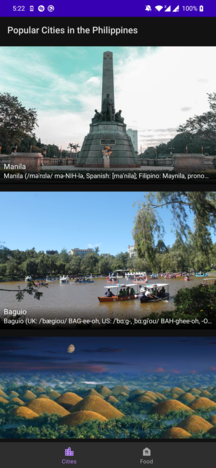
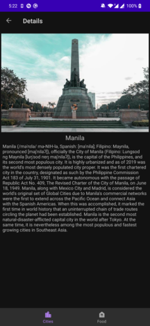
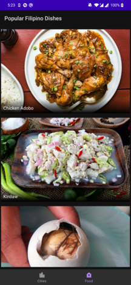

# Android Demo
- Shows a list that includes cities and food by fetching from the following endpoint: 
  - https://api.npoint.io/a2b63ef226c08553b2f9

## Screenshots

  
   
  

## Libraries Used
* Components
  - LiveData - Data holder class that is observed for DB changes
  - Navigation Component - Used to navigate between fragments (in this app, only 1 activity exists)
  - Room - For local data persistence
  - ViewModel - Stores UI related data
  - NetworkBoundResouce - Interface to fetch data from DB and the network
* Third Party/ Miscellaneous
  - [Glide](https://bumptech.github.io/glide/) - For image loading
  - [Hilt](https://developer.android.com/training/dependency-injection/hilt-android) - For dependency injection
  - [Kotlin Coroutines](https://kotlinlang.org/docs/coroutines-overview.html) - For managing background threads for network/DB operations
  - [Retrofit](https://square.github.io/retrofit/) - HTTP Client used
  - [Gson Converter](https://github.com/square/retrofit/tree/master/retrofit-converters/gson) - Used with Retrofit for JSON manipulation

## Improvements
1. Pull to refresh/ Retry
   - Needed when app is opened for the first time and there is no Internet
   - Suggestion: Use Paging library
